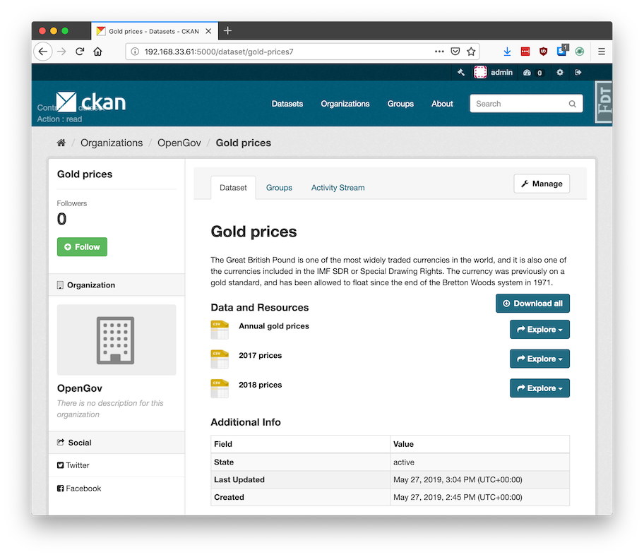

.. You should enable this project on travis-ci.org and coveralls.io to make
   these badges work. The necessary Travis and Coverage config files have been
   generated for you.

.. image:: https://travis-ci.org/davidread/ckanext-downloadall.svg?branch=master
    :target: https://travis-ci.org/davidread/ckanext-downloadall

.. image:: https://img.shields.io/pypi/v/ckanext-downloadall.svg
    :target: https://pypi.python.org/project/ckanext-downloadall/
    :alt: Latest Version

.. image:: https://img.shields.io/pypi/pyversions/ckanext-downloadall.svg
    :target: https://pypi.python.org/project/ckanext-downloadall/
    :alt: Supported Python versions

.. image:: https://img.shields.io/pypi/status/ckanext-downloadall.svg
    :target: https://pypi.python.org/project/ckanext-downloadall/
    :alt: Development Status

.. image:: https://img.shields.io/pypi/l/ckanext-downloadall.svg
    :target: https://pypi.python.org/project/ckanext-downloadall/
    :alt: License

===================
ckanext-downloadall
===================

This CKAN extension adds a "Download all" button to datasets. This downloads
a zip file containing all the resource files and a datapackage.json.

This zip file is a good way to package data for storing or sending, because:

* you keep all the data files together

* you include the documentation (metadata) - avoids the common problem of being
  handed some data files and not know anything about it or where to find info

* the metadata is machine-readable, so can be used by tools, software and in
  automated workflows. For example:

  * validating a series of data releases all meet a standard schema
  * loading it into a database, using the column types and foreign key
    relations specified in the metadata

The `datapackage.json <https://frictionlessdata.io/specs/data-package/>`_ is a
`Frictionless Data <https://frictionlessdata.io/specs/data-package/>`_
standard, also known as a Data Package.

Technical notes
~~~~~~~~~~~~~~~

If the resource is pushed/xloaded to DataStore then the schema (column types)
is also included in the datapackage.json file.

This extension uses a CKAN background job to create the zip every time a
dataset is created or updated (or its data dictionary is changed). This suits
CKANs where all files are uploaded - if the underlying data file changes
without the CKAN URL changing, then the zip will not include the update (until
something else triggers the zip to update).

(This extension is inspired by `ckanext-packagezip
<https://github.com/datagovuk/ckanext-packagezip>`_, but that is old and relied
on ckanext-archiver and IPipe.)

------------
Requirements
------------

Designed to work with CKAN 2.7+

Ideally it is used in conjunction with DataStore and
`xloader<https://github.com/ckan/ckanext-xloader>` (or datapusher), so that the
Data Dictionary is included as a schema in the datapackage.json, to describe
the column types.

------------
Installation
------------

To install ckanext-downloadall:

1. Activate your CKAN virtual environment, for example::

     . /usr/lib/ckan/default/bin/activate

2. Install the ckanext-downloadall Python package into your virtual environment::

     pip install ckanext-downloadall

3. Add ``downloadall`` to the ``ckan.plugins`` setting in your CKAN
   config file (by default the config file is located at
   ``/etc/ckan/default/production.ini``). e.g. ::

     ckan.plugins = downloadall

4. Restart the CKAN worker. For example if you've deployed it with supervisord::

     sudo supervisorctl restart ckan-worker:ckan-worker-00

5. Restart CKAN server. For example if you've deployed CKAN with Apache on
   Ubuntu::

     sudo service apache2 reload

6. Ensure the background job 'worker' process is running - see
https://docs.ckan.org/en/2.8/maintaining/background-tasks.html#running-background-jobs

---------------
Config Settings
---------------

None at present

.. Document any optional config settings here. For example::

..     # The minimum number of hours to wait before re-checking a resource
..     # (optional, default: 24).
..     ckanext.downloadall.some_setting = some_default_value

----------------------
Command-line interface
----------------------

There is a command-line interface::

    downloadall --help

Examples of use::

    downloadall update-zip gold-prices
    downloadall update-all-zips

---------------
Troubleshooting
---------------

**"All resource data" appears as a normal resource, instead of seeing a
"Download All" button**

You need to enable this extension in the CKAN config and restart the server.
See the Installation section above.

**ImportError: No module named datapackage**

This means you have an older version of ckanapi, which is a dependency of
ckanext-downloadall. Install a newer version.

**OSError: [Errno 13] Permission denied: '/data/ckan/resources/c89'**

You are trying to update zips from the command-line but running the tasks
synchronously, rather than with the normal worker process. In this case you
need to run it as the `www-data` user e.g.::

    sudo -u www-data /usr/lib/ckan/default/bin/downloadall -c /etc/ckan/default/production.ini update-all-zips --synchronous

------------------------
Development Installation
------------------------

To install ckanext-downloadall for development, activate your CKAN virtualenv
and do::

    git clone https://github.com/davidread/ckanext-downloadall.git
    cd ckanext-downloadall
    python setup.py develop
    pip install -r dev-requirements.txt

Remember to run the worker (in a separate terminal)::

    paster --plugin=ckan jobs worker --config=/etc/ckan/default/development.ini

-----------------
Running the Tests
-----------------

To run the tests, do::

    nosetests --nologcapture --with-pylons=test.ini

To run the tests and produce a coverage report, first make sure you have
coverage installed in your virtualenv (``pip install coverage``) then run::

    nosetests --nologcapture --with-pylons=test.ini --with-coverage --cover-package=ckanext.downloadall --cover-inclusive --cover-erase --cover-tests

----------------------------------------------
Releasing a New Version of ckanext-downloadall
----------------------------------------------

ckanext-downloadall is availabe on PyPI as https://pypi.org/project/ckanext-downloadall/.
To publish a new version to PyPI follow these steps:

1. Update the version number in the ``setup.py`` file.
   See `PEP 440 <http://legacy.python.org/dev/peps/pep-0440/#public-version-identifiers>`_
   for how to choose version numbers.

2. Update the CHANGELOG.md with details of this release.

3. Make sure you have the latest version of necessary packages::

    pip install --upgrade setuptools wheel twine

4. Create a source and binary distributions of the new version::

       python setup.py sdist bdist_wheel && twine check dist/*

   Fix any errors you get.

5. Upload the source distribution to PyPI::

       twine upload dist/*

6. Commit any outstanding changes::

       git commit -a

7. Tag the new release of the project on GitHub with the version number from
   the ``setup.py`` file. For example if the version number in ``setup.py`` is
   0.0.1 then do::

       git tag 0.0.1
       git push --tags
